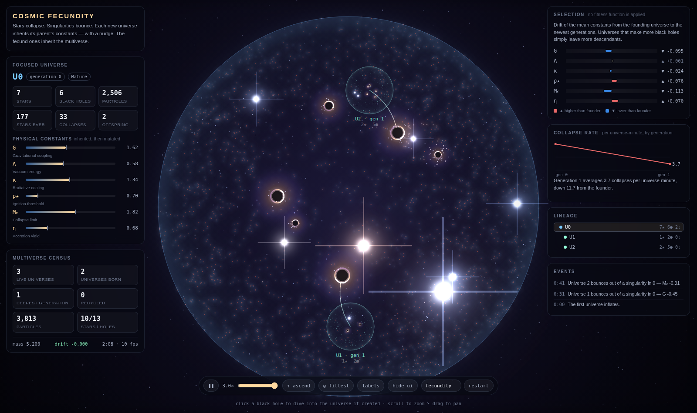
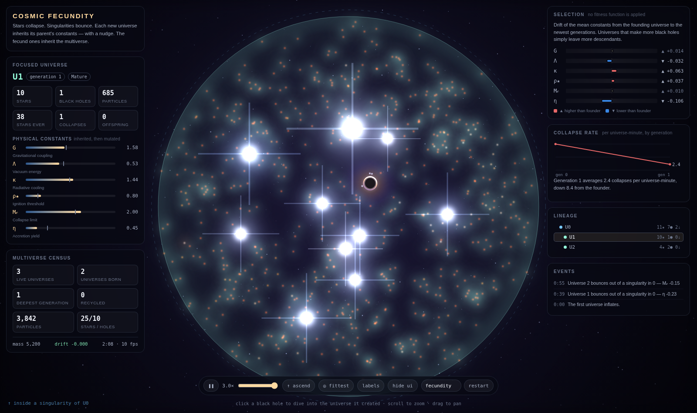

# Cosmic Fecundity



A perpetual particle-engine simulation of **cosmological natural selection** — Lee Smolin's
proposal that black holes bounce into new universes, that those universes inherit their
parent's physical constants with slight variation, and that the constants we observe are
therefore the ones that make universes good at producing black holes.

Everything in the demonstration follows from one loop:

```
   inflation → cold gas → molecular clouds → stars → collapse → black holes
        ↑                                                          │
        └──────── umbilical feed ←── parent BH ←── polar jets ←────┘
```

A black hole that banks enough infalling matter buds off a **child universe** with a mutated
genome. It then keeps pumping matter down the umbilical, and the child's own black holes
route a share back up, where it erupts from the parent's poles as jet outflow and becomes
the next generation of star-forming gas. Nothing runs down; matter circulates.

## What it is actually demonstrating

Two properties are load-bearing, and both are checked rather than asserted:

**Mass is conserved, exactly.** No universe is created out of nothing — a child is paid for
out of its parent black hole's accretion, and every recycled universe hands its matter back
up the tree. The HUD carries a live ledger; after thirty simulated minutes the drift is on
the order of 10⁻⁴ out of 6200, which is float32 rounding on the particle store and nothing
else. This is what makes the system perpetual rather than merely long-running.

**Nothing selects for anything.** There is no fitness function anywhere in the codebase. A
universe reproduces when one of its black holes has swallowed enough matter, full stop. The
gene drift shown in the readout is differential reproduction and nothing else: universes
that collapse more of their matter into singularities leave more descendants, so their gene
values are over-represented in the census of universes ever born.

`fecundity()` in `src/sim/genome.js` is descriptive only — it is read by the HUD and by the
recycling policy for choosing which spent branch to reclaim, never by the physics.

## Running it

```bash
python3 -m http.server 8123      # or: npm start
# open http://127.0.0.1:8123
```

It is a plain ES-module project — no build step, no runtime dependencies. For a single file
you can open directly or host anywhere:

```bash
npm run build                    # → dist/cosmic-fecundity.html
```

### Controls

| | |
|---|---|
| **click a black hole** | dive into the universe it created |
| **Backspace** / right-click / `↑ ascend` | climb back out to the parent |
| scroll / drag | zoom and pan |
| `F` | jump to the most fecund universe |
| Space | pause |
| `+` / `-` | simulation speed |
| `L` / `U` / `H` | toggle labels / umbilicals / interface |
| `R` | restart from the seed in the box |

Seeds are deterministic: the same seed always replays the same multiverse.



*Diving into a child universe. It has its own genome, its own black hole, and the tint of
its generation; the marker in the corner names the singularity it came out of.*

## The genome

Six heritable constants, re-randomised slightly at each bounce. Ranges and mutation widths
are in `src/sim/genome.js`.

| | | effect |
|---|---|---|
| `G` | gravitational coupling | how fast clouds collapse |
| `Λ` | vacuum energy | expansion pressure; above ~0.9 the universe never binds |
| `κ` | radiative cooling | how fast gas sheds heat and becomes collapsible |
| `ρ★` | ignition threshold | cloud mass needed to light a star |
| `M𝒸` | collapse limit | stellar mass above which the core becomes a singularity |
| `η` | accretion yield | efficiency of turning infalling mass into throughput |

Two of these are expressed **relative to the universe's own scale** rather than in absolute
units — the ignition mass is derived from a reference density, and the collapse limit is a
multiple of the ignition mass. Without that, a small universe's clouds could never reach an
absolute threshold set for a large one, and deep generations would be sterile for reasons
that have nothing to do with their genes.

## Architecture

```
src/engine/     the particle engine, independent of the physics it is used for
  rng.js          seeded streams; each universe forks its own
  particles.js    structure-of-arrays pool with a free list
  spatialhash.js  uniform grid — gas clumping and the star-formation trigger
  color.js        black-body ramps, pre-rendered glow sprites
  renderer.js     additive canvas renderer, bloom, nested transforms

src/sim/        the cosmology
  genome.js       the six heritable constants, mutation, census helpers
  bodies.js       stars and black holes
  universe.js     one universe: integration, star formation, accretion, budding
  multiverse.js   the tree, the mass ledger, recycling, selection statistics

src/ui/hud.js   read-outs, lineage panel, drift and collapse-rate charts
src/main.js     camera, input, transport, fixed-step loop
tools/          soak test, screenshot harness, single-file bundler
```

Three decisions are worth knowing about before reading the code:

**Every universe uses the same local coordinate space.** A universe fourteen generations
deep is simulated and drawn with exactly the same numerical precision as the root. Nesting
is handled by composing affine transforms in the renderer, and diving into a child is an
animation of the *root* transform such that the child's composed transform lands on the
full-screen framing, at which point the root is swapped. Depth costs nothing.

**Accretion discs are integrated kinematically.** A particle captured by a black hole gets
bound to that specific hole and has its radius and phase advanced directly. A softened
inverse-square law will happily hold a disc in a stable orbit forever; a disc that never
drains starves its own universe. Everything else — gas, stars, jets, holes — is solved with
ordinary forces.

**Level of detail is driven by the camera, not the tree.** The focused universe runs at full
particle budget and its neighbours are throttled, so the frame cost stays flat no matter how
large the tree grows. Trimmed particles bank their mass in the vacuum rather than vanishing,
which is why throttling doesn't perturb the ledger.

## Verifying it

```bash
npm test                # 6 simulated minutes, headless, asserts the invariants
npm run soak            # 30 minutes
node tools/soak.mjs 30 "another seed"
```

The soak test runs the simulation with no renderer and fails on non-finite mass, on drift
beyond 0.1% of the initial mass, on a sterile multiverse, on population collapse, or on the
particle population dying out. It also prints the full generational census, so gene drift is
inspectable from the terminal.

```bash
node tools/shot.mjs 45 dist/shots/scene.png 60    # headless screenshot
DIVE=1 node tools/shot.mjs 45 dist/shots/child.png 60
```

## Honest limits

- The physics is *phenomenological*, not a cosmology code. Gravity is solved between
  particles and bodies plus a grid-resolution self-gravity term; the cosmological potential
  is harmonic; accretion is kinematic. It is tuned to be legible and stable, not predictive.
- Selection is real but the sample is small — a handful of universes per generation. The
  drift you see over ten minutes is a genuine signal riding on a lot of mutation noise, and
  individual runs will disagree. Compare seeds before concluding anything about a gene.
- The collapse-rate chart is normalised per universe-minute precisely because deeper
  generations are younger; comparing raw totals would read that age difference as a
  difference in fecundity.
- A universe's black holes are capped in how much they can retain, and universes are
  recycled when they run down or when the census is full. Both are budget decisions, and
  both are visible in the census — but they are decisions, not physics.
